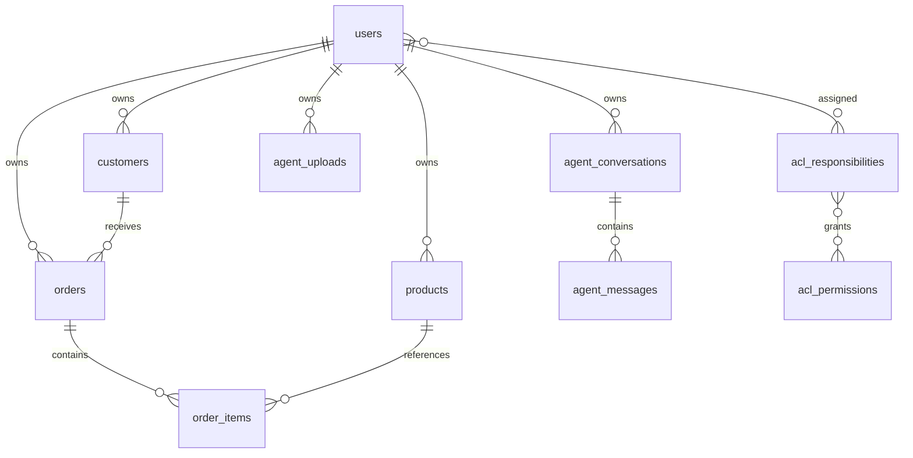

# Modelo de Dados

## Entidades principais

### `users`

Representa a conta autenticável do sistema.

Também concentra:

- credenciais web
- credenciais mobile
- flags de admin e agente
- 2FA
- bloqueio

### `customers`

Representa clientes pertencentes a um usuário.

Campos operacionais principais:

- nome
- empresa
- e-mail
- telefone
- documento
- observações

### `products`

Representa produtos pertencentes a um usuário.

Campos operacionais principais:

- nome
- SKU
- descrição
- preço
- status ativo

### `orders`

Representa pedidos pertencentes a um usuário e vinculados a um cliente do mesmo dono.

Campos operacionais principais:

- número público
- referência
- status
- observações
- total consolidado

### `order_items`

Representa os itens de cada pedido.

Campos operacionais principais:

- produto
- quantidade
- preço unitário
- status do item

### `acl_permissions`

Catálogo de permissões administrativas.

### `acl_responsibilities`

Conjunto nomeado de permissões atribuível a usuários.

### `audit_logs`

Registro de eventos administrativos e operacionais relevantes do backend.

### `agent_conversations`

Conversa persistida do CodaFácil IA.

### `agent_messages`

Mensagens das conversas do CodaFácil IA.

### `agent_uploads`

Uploads PDF processados pelo módulo CodaFácil IA.

## Regras base

- `Customer` pertence a um `User`
- `Product` pertence a um `User`
- `Order` pertence a um `User`
- `Order` referencia um `Customer` do mesmo `User`
- `OrderItem` referencia um `Product` compatível com o dono do pedido
- ACL efetiva combina responsabilidades com permissões diretas por usuário
- O CodaFácil IA usa `AgentConversation`, `AgentMessage` e `AgentUpload`

## Ownership

No front e na API mobile, cada usuário enxerga apenas os próprios registros.

O backend concentra visão global, condicionada a permissões ACL.
